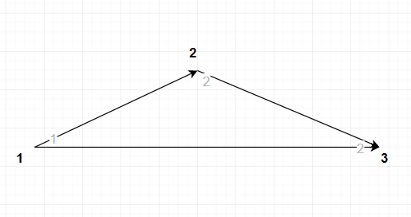
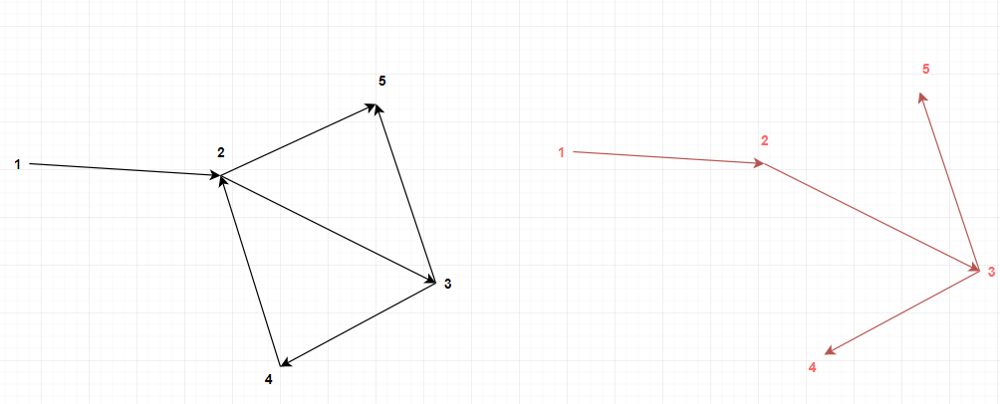

# List solved problem
- Problem 1
- Problem 3
- Problem 4

## Problem 1 (Rotate picture) Complexity
##### n: is the length of row
- Code line {15} use Array.prototype.reverse, that will take O(n) complexity
- Code line {5} has a loop with O(4) complexity
- Code line {10, 12} also has a loop with O(n) complexity
- Combining above functions's complexity, we have the complexity: O(4*(n*(n + n))) = O(n^2)

## Problem 3 (Finding Optimal Path) Complexity
##### n: vertices, m: edges
- The complexity: O(n^3)
- Following the input of problem 3, i used <b>numbers</b> instead of <b>words</b> to make it 
easy for inputting and implementation
- Example for the first test case:
    - weights = [1, 2, 2]: is the value of vertices at respective position (ex: vertices at position 1 has value of 1, position 2 has value of 2 and position 3 has value of 2)
    - edges = [[1, 2], [2, 3], [1, 3]]: 3 edges ( 1 -> 2, 2 -> 3 and 1 -> 3)
    
- An image for the second test case, red line is the answer:
    

## Problem 4 (Hotel Reservation) Complexity
##### n: is the length of arrivals and departures time
##### x: is the maximum range from arrival time to departure time
- Code line {7} has a loop with O(n) complexity
- We have the worst-case time complexity is O(x*n)

## How to run all the test suites with jest

- Run `npm run test`
